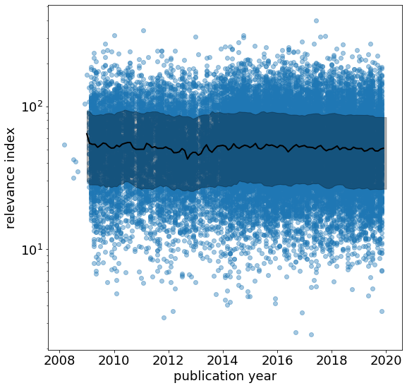
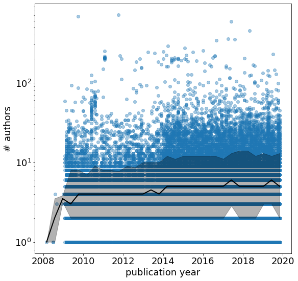

# meta analysis using the pre-trained `galaxies_all` model.

We define the relevance index of a paper as the sum of the correlation reported by Doc2Vec for the top 100 closest related papers. 

Histogram over entire dataset: 


The most and least connected papers are:

```
Most related paper(s): 
----------------------
ID: http://arxiv.org/abs/1705.03957v1 Title: ALMA Images of the Orion Hot Core at 349 GHz
 
Least related paper(s): 
-----------------------
ID: http://arxiv.org/abs/1608.06756v1  Title: The intrinsic beauty of polytropic spheres in reduced variables
```

Defining what 'connected' or 'related' mean in this context is rather sensitive, however. It requires further hacking to understand the basis on which two papers are awarded a high similarity coefficient by the Doc2Vec model given our training data and parameters. We ideally do not want the trained model to simply pick up on common phrases or jargon, but rather the context in which two papers are similar. This interpretability question is set to be explored the next time I have a hack day that I can spend working on this project. 

Correlations with other quantities:

1. Number of authors:


2. Number of citations:


3. Publication year:


Number of authors as a function of time:

